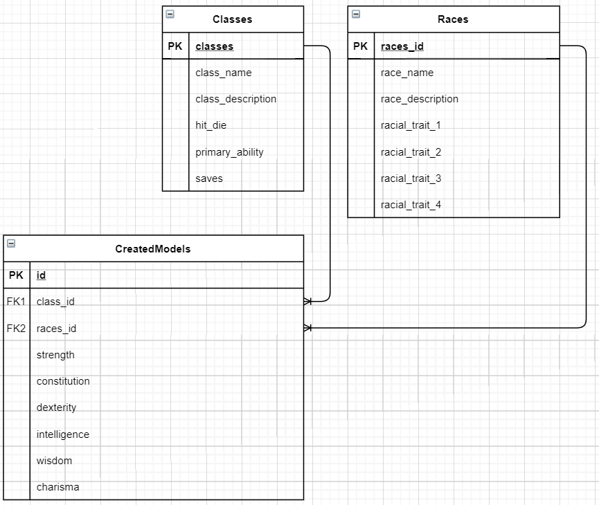
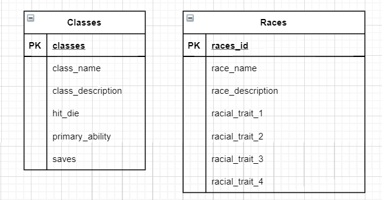
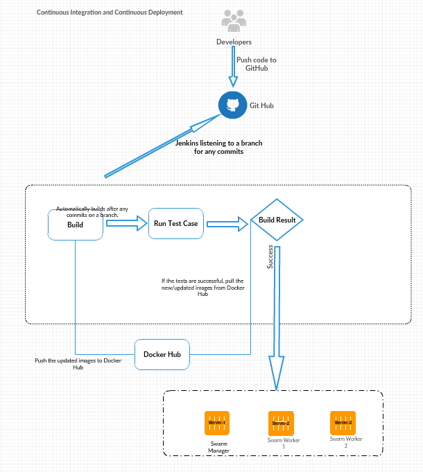

### SFIA-Project-2
# D&D Character Generator

## Base Requirements
---
For this project we were tasked with creating an app with four services which can all communicate with each other, and to deploy it using Docker and a Jenkins pipeline, as well as a few other technologies.\
To fulfil these requirements, I decided to make a D&D character generator, that randomly assigns the user a race, class, and attribute points, as well as displaying the race/class related traits and adding attribute points where required.\
## Technologies Used
---
Ansible\
Docker\
Docker Compose\
Docker Swarm\
Docker Stack\
Flask\
Git / Github\
Jenkins\
Jira\
Pytest\
Python
## Architecture
---
The database that I used in this program was quite simple, with just three tables, and I created a fairly simple ERD to display the values that would be entered into each table and how they are going to be linked.\

Initially I did not have the created models table, which meant that my tables were even simpler, with no relationships at all!\

However this changed as I made my program a bit more complicated and decided that I wanted to be able to store previously generated models in the database.
## Deployment
---
The deployment of my program was mostly done using a Jenkins pipeline. This pipeline has three main steps; build, test, and deploy.\
The build section of the pipeline ensures that the swarm VMs have the appropriate software installed, and that they're correctly connected to the swarm. It also builds the dDcker images from the Dockerfiles in the app folder, using Docker compose to streamline the process. These builds are then pushed to Docker Hub so that I can retrieve them at my convenience later.\
The testing section does exactly what you'd expect it to, it goes through all of the individual services and runs tests on them to ensure that they work as they should. Using Pytest I was able to get a minimum of 90% coverage with my testing, and much of the code that was missed was only missed because it wasn't actually used in the program, and was only there in case the client wished to expand upon the functionality of the application. These include (but are not limited to) the functions to lower attribute points, and the functions to view the attribute points.\
The deploy section is also fairly self-explanitory. It deploys the application using Docker stack, which will allow the application to be deployed over serveral different VMs, using the images that we pushed to Docker Hub earlier, so long as they are all connected to the same Docker swarm. This means that there is less chance of the whole program crashing, as if one node goes down Docker will automatically re-deploy the containers to other VMs.\

## Steps to run the program
---
On VM 1, you must install a few things to ensure that Jenkins will run everything properly.
The first thing is obviously Jenkins, without this a lot of the automated process becomes significantly less automated.\
\
After that, you need to ensure that Ansible is installed so that you can run the Ansible playbook which ensures that the other machines have the appropriate software installed on them.\
It's also important to install Pytest on VM 1. Since this is the only machine that will be running testing, I opted not to add it through Ansible, however that's a process that would be relatively easy to add should the need become apparent.\
The Jenkins script will then run through the process of building, testing, and deploying the program, as explained above.
## Testing
---
With my testing I was able to reach a minimum of 90% coverage, with the only bits of code not being tested being the lines that aren't actually used, and are only coded so that should I want to expand the functionality of the program it wouldn't be too hard. These lines of code are essentially just to edit the attributes of my PlayerCharacter model. While I use the functions that add value to the attributes, I do not currently have any need to remove value from, or examine the value of the classes attributes, and so while those lines are coded in, they are superfluous at the moment.\
Having said that, the vast majority of the program has been tested, from ensuring that all the pages succesfully load, to making sure that the main view all page loads after the generate page has done its job. This means that no matter the outcome of the generate page, we've ensured that the view all page will still load properly, and that the various APIs return valid results.
## Current Bugs
---
Currently the Nginx container doesn't always deploy to every single Swarm node, meaning that if I try to connect to the website through some of the nodes it won't always work. A way to fix this would be to have Nginx running as a separate service on a dedicated VM, so that that was always the entry point for the application. This is something that can be implemented in a later build.\
I also don't quite have the seamless deployment quite down, because my swarm leaves the current swarm, then remakes and rejoins a new swarm every time Ansible runs. This could be fixed by having that part of Ansible as a separate, once off script.
## Future Additions
---
In the future it'd be nice to add a function that allows you to build a full character sheet, including inventory. It'd also be nice to be able to upload pictures of your characters (should you so desire), and have images for the various races and classes. It'd also be beneficial to have a delete function so that you can delete the randomly generated character should you so desire, as well as making sure that there's no duplicates in the database, so that the database doesn't get clogged up.\
Another feature that would be a good addition is that with some classes/races, you get a +1 or +2 to some attributes, which are currently hard coded to be added to specific attributes, instead of randomly assigning them as it should be. This shouldn't be too difficult to solve, a simple rng would be able to fix this. I'd also like to assign attributes the correct way, which is to roll 4 d6 and ignore the lowest one, whereas at the moment I'm just rolling 3 and getting to total from there.
## Acknowledgements
---
CA for teaching me the skills required to create this project.
My cohort and instructors for their continued support.
## Author(s)
---
Ed Pricket (Coding, Design, Implementation)
DnD Beyond (Class and Race information)